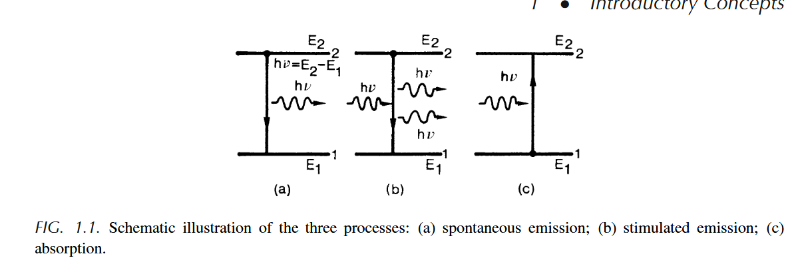

#! https://zhuanlan.zhihu.com/p/657108362
# 1 光的相干性
# 2 光的受激辐射
受激辐射概念是爱因斯坦首先提出的 (1917 年）。在普朗克 (Max Planck) 于 1900 年用辐射量子化假设成功地解释了黑体辐射分布规律，以及波尔 (Niels Bohr) 在 1913 年提出原子中电子运动状态量子化假设的基础上，爱因斯坦从光量子概念出发，重新推导体辐射的普朗克公式，并在推导中提出了两个极为重要的概念：受激辐射和自发辐射。 
40年后，受激辐射概念在激光技术中得到了重要的应用。
## 2.1 黑体普朗克公式
在温度 T 的热平衡情况下，黑体辐射分配到腔内每个模式上 的平均能量为
$$ E= \frac{hv}{e^{\frac{h \nu}{k_{b}{T}}-1}} \tag{2.1.1}$$
频率间隔内的光波模式数 $n_{v}$为
$$ n_{\nu}= \frac{N_{v}}{Vdv}= \frac{8 \pi v^{2}}{c^{3}}\tag{2.1.2} $$
于是,黑体辐射普朗克公式为
$$ \rho_{\nu}= \frac{8 \pi h \nu ^{3}}{c^{3}}\frac{1}{e^{\frac{hv}{k_{b}{T}}-1}}\tag{2.1.3} $$
式中,$k_{b}$ 为玻耳兹曼常数,其数值为
其中玻尔兹曼常数$k_{b}=1.38062 \times 10^{-23}J/K$，普朗克常数$h$
## 2.2 受激辐射和自发辐射概念Q

> (a) spontaneous自发辐射; (b) stimulated受激辐射; (c)absorption 吸收  
·
自发发射过程和受激发射过程之间存在根本区别。
+ 在自发发射的情况下，原子发射任何方向电磁波。
+ 在受激发射的情况下，任何原子的发射与入射波的相位同相，位置相同。
$$E_{2}-E_{1}=h \nu \tag{1.1}$$

